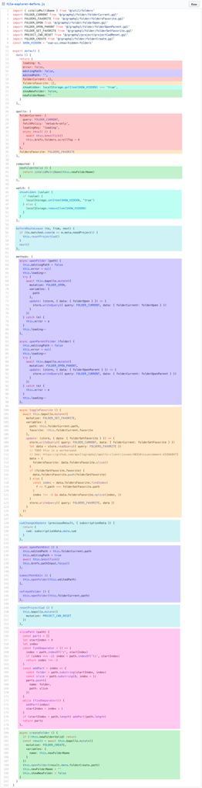

# React Hooks 在业务中的应用入门

本示例分享hooks在业务中的常见应用, 分享在开发业务中的优势, 以及常用思路, 具体查看src/pages下面的代码示例

## 优势1: 复用相同的状态逻辑
查看UserList.tsx和UserListSelect.tsx
[官方说明](https://zh-hans.reactjs.org/docs/hooks-intro.html#its-hard-to-reuse-stateful-logic-between-components)

## 优势2: 渐进式重构
当一个业务组件(由于某些原因)代码变得越来越长, 重构就是将一些状态提取成自定义的hooks, 比类组件重构容易而且安全很多
比如使用ahooks的useVirtualList重构大数据量列表

## 优势3: 业务逻辑更加集中化, 数据流自顶向下
业务集中化, 意味着修改或者扩展某些业务逻辑将会效率和安全性更高, 这个在[vue3.0 composition API](https://v3.cn.vuejs.org/guide/composition-api-introduction.html#%E4%BB%8B%E7%BB%8D)中文档有详细解释
传统的开发中的业务分部在不同的生命这期钩子中, 一方面, 对于一个刚接手的开发不是很友好,样修改, 重构, 扩展某一功能, 需要在这些生命周期中不断的来回修改<br/ >
比如: 相同的颜色代码块处理某个业务逻辑



## 劣势
useEffect等副作用会造成理解上的困惑, 特别是不同的effect修改同一个state, 导致重构变得困难, 所以尽可能少用useEffect
```typescript
useEffect(() => {
  //...
}, [x,y,z])

useEffect(() => {
  //...
}, [x1,y1,z1])

useEffect(() => {
  //...
}, [x2,y2,z2])

useEffect(() => {
  //...
}, [x3,y3,z3])
```

# 示例说明


# 优秀的hooks开源库
[阿里巴巴ahooks](https://ahooks.js.org/zh-CN)
[react-hook-form](https://react-hook-form.com)

# 对比react hooks 和 vue3.0 composition API
易用性: react >> vue
初始性能: vue > react

推荐使用react, 性能优化可以渐进式

# 讨论
业务变更与功能扩展
